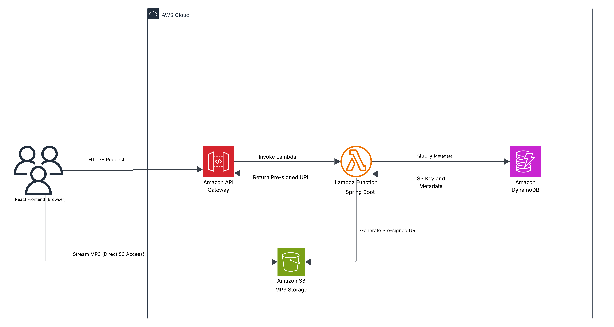

# 🎵 Musify – Serverless Music Streaming Platform

A full-stack, serverless music streaming application built with Spring Boot, React, and AWS. 
Musify enables secure MP3 streaming using pre-signed S3 URLs and scalable serverless backend architecture.

## 📐 System Architecture

The application follows a fully serverless architecture:
1. React frontend sends API requests.
2. Amazon API Gateway routes HTTPS requests to AWS Lambda.
3. Lambda (Spring Boot) interacts with DynamoDB for metadata.
4. Lambda generates pre-signed URLs for secure S3 access.
5. Client streams MP3 files directly from S3.



## 🚀 Features

- 🎵 Upload and stream MP3 files
- 🔐 Secure file access using pre-signed S3 URLs
- ⚡ Fully serverless backend using AWS Lambda
- 📦 Metadata storage using DynamoDB
- 🌍 Scalable architecture using API Gateway
- ☁️ Cloud-native deployment

## 🛠️ Tech Stack

### Frontend
- React 18 + TypeScript
- Vite build tool
- Bootstrap 5 + Custom CSS

### Backend
- Spring Boot
- AWS SDK v2
- AWS Lambda
- AWS API Gateway
- AWS S3
- AWS DynamoDB


## 🔍 Secure Streaming Flow

1. User requests a song.
2. Lambda retrieves S3 object key from DynamoDB.
3. Lambda generates a time-limited pre-signed URL.
4. URL is returned to React.
5. React streams the MP3 directly from S3.

This ensures:
- No direct public access to S3
- Time-bound secure streaming
- Reduced backend load

## ⚙️ Prerequisites

- Node.js 18+
- Java 21+
- AWS Account
- AWS CLI configured

## 🚀 Quick Start

### 1. Backend Setup

```bash
cd musify-backend
mvn clean install
mvn spring-boot:run
```

### 2. Frontend Setup

```bash
cd musify-frontend
npm install
npm run dev
```


## ☁️ Deployment

The backend is deployed as a serverless application:

- Spring Boot application packaged using AWS Lambda Java runtime.
- API Gateway configured for HTTP routing
- IAM roles configured with least-privilege access
- S3 used for object storage
- DynamoDB used for metadata storage


## 📈 Design Decisions

- Serverless architecture reduces operational overhead
- Pre-signed URLs offload streaming directly to S3
- DynamoDB ensures low-latency metadata retrieval
- API Gateway enables scalable request routing
- Stateless Lambda functions improve horizontal scaling


## 🔮 Future Enhancements

- User authentication with AWS Cognito
- Playlists and favorites
- Caching using Redis
- CloudFront CDN for faster streaming
- Monitoring with CloudWatch


## 👨‍💻 Author

Adarsh Kumar  
MS in Information Systems  
AWS Certified Developer  